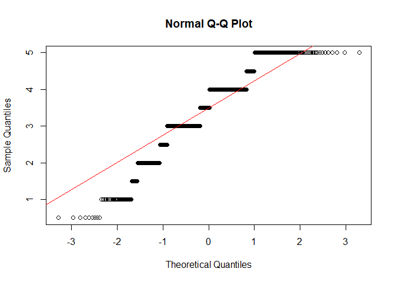
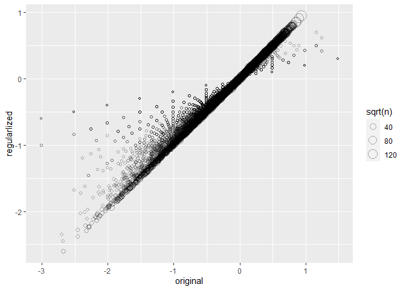
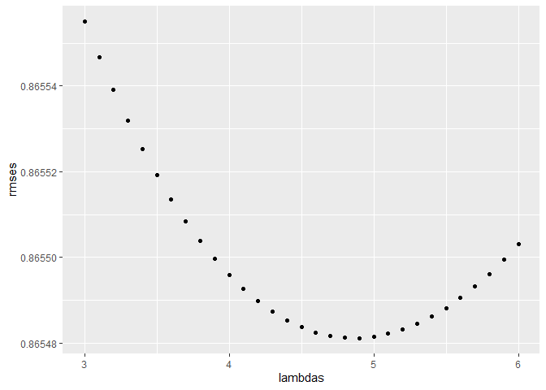
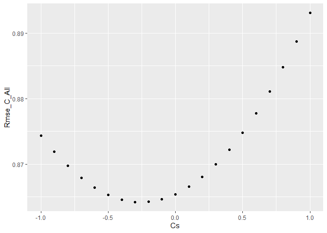
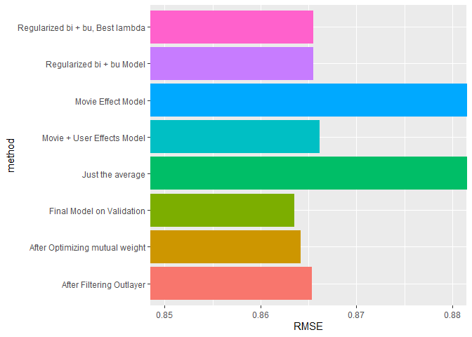

Movie Rating Prediction
================
Ahmad\_Abboud

\#Movie Rating Prediction

\#\#Introduction

This report presents a prediction model to predict the rating on a
MovieLense Dataset. This data set contains 10000054 ratings and 95580
tags applied to 10681 movies by 71567 users of the online movie
recommender service MovieLens. Users were selected at random for
inclusion. All users selected had rated at least 20 movies. Each user is
represented by an id, and no other information is provided. The data are
contained in three files, movies.dat, ratings.dat and tags.dat. More
details about the contents and use of all these files can be found on
(<https://grouplens.org/datasets/movielens/10m/>). To predict user
ratings, a linear model was proposed that takes into consideration
average rating, user average rating and movie average rating. Then a
regularization effect is added to the model that adds a penalty to low
number rating compared to high numbers which improve the RMSE results.
Finally, the model is further optimized by tuning the weight of user and
movie effects on rating prediction.

\#\#Method and Analysis

In this section, we will start with data preparation, by downloading the
dataset, creating training and validation set, clean the data. Then we
will explore the data by viewing effect of movie and users on rating.
Later, modeling the prediction and optimizing the model will take place.

\#\#\#Data Preparation

First lets download and install required libraries.

    ## Loading required package: tidyverse

    ## -- Attaching packages --------------------------------- tidyverse 1.3.0 --

    ## v ggplot2 3.3.0     v purrr   0.3.3
    ## v tibble  3.0.0     v dplyr   0.8.5
    ## v tidyr   1.0.2     v stringr 1.4.0
    ## v readr   1.3.1     v forcats 0.5.0

    ## -- Conflicts ------------------------------------ tidyverse_conflicts() --
    ## x dplyr::filter() masks stats::filter()
    ## x dplyr::lag()    masks stats::lag()

    ## Loading required package: caret

    ## Loading required package: lattice

    ## 
    ## Attaching package: 'caret'

    ## The following object is masked from 'package:purrr':
    ## 
    ##     lift

    ## Loading required package: data.table

    ## 
    ## Attaching package: 'data.table'

    ## The following objects are masked from 'package:dplyr':
    ## 
    ##     between, first, last

    ## The following object is masked from 'package:purrr':
    ## 
    ##     transpose

Now lets download the Dataset.

Creating partitions as follows 90% training and 10% Validation set.

``` r
# Validation set will be 10% of MovieLens data
set.seed(1, sample.kind="Rounding")
test_index <- createDataPartition(y = movielens$rating, times = 1, p = 0.1, list = FALSE)
edx <- movielens[-test_index,]
temp <- movielens[test_index,]
```

\#\#\#Data Cleaning When preparing the validation set we must make sure
that all users and movies in the training set (edx) are presented in the
validation set then clear the R memory fom unnecessary objects.

    ## Joining, by = c("userId", "movieId", "rating", "timestamp", "title", "genres")

## Exploratory Data Analysis

After preparing the data let’s have a look on its structure of the
datasets.

``` r
# edx Dataset dimension
print(paste("edx rows=",nrow(edx)))
```

    ## [1] "edx rows= 9000055"

``` r
print(paste("edx cols=",ncol(edx)))
```

    ## [1] "edx cols= 6"

``` r
print(paste("edx names=",names(edx)))
```

    ## [1] "edx names= userId"    "edx names= movieId"   "edx names= rating"   
    ## [4] "edx names= timestamp" "edx names= title"     "edx names= genres"

``` r
# number of zero ratings
print(paste("number of zero ratings"))
```

    ## [1] "number of zero ratings"

``` r
print(sum(edx$rating==0))
```

    ## [1] 0

``` r
# Number of unique Movies
print(paste("Number of unique Movies"))
```

    ## [1] "Number of unique Movies"

``` r
print(length(unique(edx$movieId)))
```

    ## [1] 10677

``` r
# Number of Uniqe Users
print(paste("Number of Users"))
```

    ## [1] "Number of Users"

``` r
print(length(unique(edx$userId)))
```

    ## [1] 69878

``` r
# Max number of rating 
print(paste("Max number of ratings"))
```

    ## [1] "Max number of ratings"

``` r
edx %>% group_by(movieId,title) %>% filter(n() > 2000) %>% summarize(count=n()) %>% arrange(desc(count))%>% head(10)
```

    ## # A tibble: 10 x 3
    ## # Groups:   movieId [10]
    ##    movieId title                                                        count
    ##      <dbl> <chr>                                                        <int>
    ##  1     296 Pulp Fiction (1994)                                          31362
    ##  2     356 Forrest Gump (1994)                                          31079
    ##  3     593 Silence of the Lambs, The (1991)                             30382
    ##  4     480 Jurassic Park (1993)                                         29360
    ##  5     318 Shawshank Redemption, The (1994)                             28015
    ##  6     110 Braveheart (1995)                                            26212
    ##  7     457 Fugitive, The (1993)                                         25998
    ##  8     589 Terminator 2: Judgment Day (1991)                            25984
    ##  9     260 Star Wars: Episode IV - A New Hope (a.k.a. Star Wars) (1977) 25672
    ## 10     150 Apollo 13 (1995)                                             24284

``` r
#Most Givin Ratings
print(paste("Most Givin Ratings"))
```

    ## [1] "Most Givin Ratings"

``` r
edx %>% group_by(rating) %>% summarize(count=n()) %>% arrange(desc(count))%>% head(10)
```

    ## # A tibble: 10 x 2
    ##    rating   count
    ##     <dbl>   <int>
    ##  1    4   2588430
    ##  2    3   2121240
    ##  3    5   1390114
    ##  4    3.5  791624
    ##  5    2    711422
    ##  6    4.5  526736
    ##  7    1    345679
    ##  8    2.5  333010
    ##  9    1.5  106426
    ## 10    0.5   85374

### Prepare Data for Modeling

Before start modeling on edx dataset, lets repartition it into training
and test set. This is necessary since we will preserve the validation
set just for final validation of our model.

``` r
# Partition dataset to test and training 
set.seed(2020,sample.kind = "Rounding")
test_index <- createDataPartition(y = edx$rating, times = 1,
                                 p = 0.2, list = FALSE)
train_set <- edx[-test_index,]
test_set <- edx[test_index,]

# The train set and the trest set considered without NA's 
print(sum(is.na(edx$rating)))
```

    ## [1] 0

``` r
# Now Lets filter only records that are in the train set
test_set <- test_set %>% 
  semi_join(train_set, by = "movieId") %>%
  semi_join(train_set, by = "userId")
```

At this point we will define our RMSE function for validation and test
purposes as follows.

``` r
# Define validation RMSE function
RMSE <- function(true_ratings, predicted_ratings){
  sqrt(mean((true_ratings - predicted_ratings)^2))
}
```

### Data Visualization

To have an idea about the distribution of the rating data, a quantile
plot is useful at this point.

``` r
# Lets sample 1000 sample from the training set to explore the distribution.

SampleIndex <- sample(1:nrow(train_set),1000)
SampleSet <- train_set[SampleIndex,]

# Plot the Quantile
qqnorm(SampleSet$rating);qqline(SampleSet$rating, col = 2)
```

<!-- -->

### Insights Gained

Regarding the quantile plot, it is obvious that the distribution of
rating is somehow normal. This finding motivates us to think with a
linear model that centred to the mean of the ratings.

### Modeling

We will start with a basic model that takes into consideration just the
mean of the rating as a predictor and have a look at the RMSE. Then we
will update our model step by step to improve the RMSE.

#### Modeling rating by just the mean rating

``` r
# Use Just the Average as a prediction Model 
mu<- mean(train_set$rating)
naive_rmse <- RMSE(test_set$rating, mu)
rmse_results <- data_frame(method = "Just the average", RMSE = naive_rmse)
```

    ## Warning: `data_frame()` is deprecated as of tibble 1.1.0.
    ## Please use `tibble()` instead.
    ## This warning is displayed once every 8 hours.
    ## Call `lifecycle::last_warnings()` to see where this warning was generated.

``` r
# Show RMSE results
rmse_results %>% knitr::kable()
```

| method           |     RMSE |
| :--------------- | -------: |
| Just the average | 1.060572 |

#### Adding Movie effect (bi) to the Model

The RMSE considering just the average rating is too high, we can improve
this result by adding the movie effect (bi) to the model. This makes
sense since famous Movies get a higher rating on average.

``` r
# Add Movie effect (bi) to Model the prediction
movie_avgs <- train_set %>% 
  group_by(movieId) %>% 
  summarize(b_i = mean(rating - mu))

# Predict rating on the test set
predicted_ratings <- mu + test_set %>% 
  left_join(movie_avgs, by='movieId') %>%
  .$b_i
# Calculating RMSE for this Model
model_1_rmse <- RMSE(predicted_ratings, test_set$rating)
# Adding results to the table of results
rmse_results <- bind_rows(rmse_results,
                          data_frame(method="Movie Effect Model",
                                     RMSE = model_1_rmse ))
# Showing the Results table
rmse_results %>% knitr::kable()
```

| method             |      RMSE |
| :----------------- | --------: |
| Just the average   | 1.0605725 |
| Movie Effect Model | 0.9437076 |

#### Adding User Effect (bu) to the Model

The addition of Movie effect to the model showes a slightly improvement
in the RMSE.

``` r
# Add User effect bu to the Model

user_avgs <- train_set %>% 
  left_join(movie_avgs, by='movieId') %>%
  group_by(userId) %>%
  summarize(b_u = mean(rating - mu - b_i))

# Predicting based on the test set
predicted_ratings <- test_set %>% 
  left_join(movie_avgs, by='movieId') %>%
  left_join(user_avgs, by='userId') %>%
  mutate(pred = mu + b_i + b_u) %>%
  .$pred
# calculatin RMSE
model_2_rmse <- RMSE(predicted_ratings, test_set$rating)
# Adding Results to the table of results
rmse_results <- bind_rows(rmse_results,
                          data_frame(method="Movie + User Effects Model",  
                                     RMSE = model_2_rmse ))
# Showing the Results table
rmse_results %>% knitr::kable()
```

| method                     |      RMSE |
| :------------------------- | --------: |
| Just the average           | 1.0605725 |
| Movie Effect Model         | 0.9437076 |
| Movie + User Effects Model | 0.8661719 |

Lets explore the top 10 movies by rating.

``` r
# Get Movie Titles
movie_titles <- edx %>% 
  select(movieId, title) %>%
  distinct()
# Here we can see that the top movies has low number of ratings 
train_set %>% dplyr::count(movieId) %>% 
  left_join(movie_avgs) %>%
  left_join(movie_titles, by="movieId") %>%
  arrange(desc(b_i)) %>% 
  select(title, b_i, n) %>% 
  slice(1:10) %>% 
  knitr::kable()
```

    ## Joining, by = "movieId"

| title                                                 |     b\_i | n |
| :---------------------------------------------------- | -------: | -: |
| Satan’s Tango (Sátántangó) (1994)                  | 1.487502 | 1 |
| Shadows of Forgotten Ancestors (1964)                 | 1.487502 | 1 |
| Fighting Elegy (Kenka erejii) (1966)                  | 1.487502 | 1 |
| Sun Alley (Sonnenallee) (1999)                        | 1.487502 | 1 |
| Pornographers, The (1966)                             | 1.487502 | 1 |
| Angus, Thongs and Perfect Snogging (2008)             | 1.487502 | 1 |
| Human Condition III, The (Ningen no joken III) (1961) | 1.237502 | 4 |
| Titicut Follies (1967)                                | 1.237502 | 2 |
| Constantine’s Sword (2007)                            | 1.237502 | 2 |
| More (1998)                                           | 1.154168 | 6 |

By exploring the movie’s ranking it seems that the top 10 movies have a
low number of rating. This effect can worsen the prediction. This brings
us to apply regularization.

### Adding Regularization to the Model

Regularization can be seen as to apply a penalty on low rating samples
which will make the model rely on most on the high rating results.

where lambda is a tuning parameter that can be chosen using
cross-validation and Yu,I is the rating of user u on the movie i.

``` r
# First lets chose an arbitrary lambda =4
lambda <- 4

movie_reg_avgs <- train_set %>% 
  group_by(movieId) %>% 
  summarize(b_i = sum(rating - mu)/(n()+lambda), n_i = n()) 


user_reg_avgs <- train_set %>% 
  left_join(movie_reg_avgs, by="movieId") %>%
  group_by(userId) %>%
  summarize(b_u = sum(rating - b_i - mu)/(n()+lambda))
```

We can show that the small samples n are more closed to zero by plotting
original vs regularized ratings.

``` r
# plotting reularized vs original rating
tibble(original = movie_avgs$b_i, 
           regularlized = movie_reg_avgs$b_i, 
           n = movie_reg_avgs$n_i) %>%
  ggplot(aes(original, regularlized, size=sqrt(n))) + 
  geom_point(shape=1, alpha=0.3)
```

<!-- -->

Now Lets look at the top 10 movies after regularization

``` r
# Showing a table of the 10 top movies after regularization.
train_set %>%
  dplyr::count(movieId) %>% 
  left_join(movie_reg_avgs) %>%
  left_join(movie_titles, by="movieId") %>%
  arrange(desc(b_i)) %>% 
  select(title, b_i, n) %>% 
  slice(1:10) %>% 
  knitr::kable()
```

    ## Joining, by = "movieId"

| title                                       |      b\_i |     n |
| :------------------------------------------ | --------: | ----: |
| Shawshank Redemption, The (1994)            | 0.9400115 | 22347 |
| Godfather, The (1972)                       | 0.9032235 | 14234 |
| Schindler’s List (1993)                     | 0.8529655 | 18552 |
| Usual Suspects, The (1995)                  | 0.8477926 | 17278 |
| Rear Window (1954)                          | 0.8045807 |  6340 |
| Casablanca (1942)                           | 0.8035172 |  9059 |
| Third Man, The (1949)                       | 0.7988516 |  2344 |
| Double Indemnity (1944)                     | 0.7976888 |  1758 |
| Seven Samurai (Shichinin no samurai) (1954) | 0.7961988 |  4141 |
| Paths of Glory (1957)                       | 0.7943859 |  1267 |

The top 10 movies are more intuitive as they have higher sample size.

# Lets Predict using the new regulized bi and bu

``` r
# Predict based on the new Model
  predicted_ratings <- 
    test_set %>% 
    left_join(movie_reg_avgs, by = "movieId") %>%
    left_join(user_reg_avgs, by = "userId") %>%
    mutate(pred = mu + b_i + b_u) %>%
    .$pred
# Calculating RMSE
model_3_rmse <- RMSE(predicted_ratings, test_set$rating)
# Adding Results to the Table
rmse_results <- bind_rows(rmse_results,
                          data_frame(method="Regularized bi + bu Model",  
                                    RMSE = model_3_rmse ))
# Show table of results
rmse_results %>% knitr::kable()
```

| method                     |      RMSE |
| :------------------------- | --------: |
| Just the average           | 1.0605725 |
| Movie Effect Model         | 0.9437076 |
| Movie + User Effects Model | 0.8661719 |
| Regularized bi + bu Model  | 0.8654959 |

lets find the best Lambda by tuning parameters.

``` r
lambdas <- seq(3, 6, 0.1)
rmses <- sapply(lambdas, function(l){
  mu <- mean(train_set$rating)

movie_reg_avgs <- train_set %>% 
  group_by(movieId) %>% 
  summarize(b_i = sum(rating - mu)/(n()+l), n_i = n()) 
#Note that, bi is calculated as the solution to minimize eq1

user_reg_avgs <- train_set %>% 
  left_join(movie_reg_avgs, by="movieId") %>%
  group_by(userId) %>%
  summarize(b_u = sum(rating - b_i - mu)/(n()+l))

# Predict based on the new Model
  predicted_ratings <- 
    test_set %>% 
    left_join(movie_reg_avgs, by = "movieId") %>%
    left_join(user_reg_avgs, by = "userId") %>%
    mutate(pred = mu + b_i + b_u) %>%
    .$pred
  return(RMSE(predicted_ratings, test_set$rating))
})
```

The result can be shown in the following figure

``` r
# plot lambda
qplot(lambdas, rmses)  
```

<!-- -->

``` r
lmbdBest <- lambdas[which.min(rmses)]
print(paste("Best Lambda=",lambda))
```

    ## [1] "Best Lambda= 4"

Now lets add the best result to the result table

``` r
#Add the final Model to the rmse result to compare Models  
rmse_results <- bind_rows(rmse_results,
                          data_frame(method="Regularized bi + bu, Best lambda",  
                                     RMSE = min(rmses)))
# Show table of results
rmse_results %>% knitr::kable()
```

| method                           |      RMSE |
| :------------------------------- | --------: |
| Just the average                 | 1.0605725 |
| Movie Effect Model               | 0.9437076 |
| Movie + User Effects Model       | 0.8661719 |
| Regularized bi + bu Model        | 0.8654959 |
| Regularized bi + bu, Best lambda | 0.8654812 |

### Filtering out layers

Since rating is a number between 0 and 5 we can limit the prediction to
this interval and round the outlayers to the nearest limit

``` r
movie_reg_avgs <- train_set %>% 
  group_by(movieId) %>% 
  summarize(b_i = sum(rating - mu)/(n()+lmbdBest), n_i = n()) 
#Note that, bi is calculated as the solution to minimize eq1

user_reg_avgs <- train_set %>% 
  left_join(movie_reg_avgs, by="movieId") %>%
  group_by(userId) %>%
  summarize(b_u = sum(rating - b_i - mu)/(n()+lmbdBest))

# Predict based on the new Model
  predicted_ratings <- 
    test_set %>% 
    left_join(movie_reg_avgs, by = "movieId") %>%
    left_join(user_reg_avgs, by = "userId") %>%
    mutate(pred_raw = mu + b_i + b_u) %>%
    mutate(pred=case_when(pred_raw < 0 ~ 0, pred_raw >5 ~5, TRUE ~ pred_raw )) %>%
    .$pred
# calculatin RMSE
model_4_rmse <- RMSE(predicted_ratings, test_set$rating)
#Add the final Model to the rmse result to compare Models  
rmse_results <- bind_rows(rmse_results,
                          data_frame(method="After Filtering Outlayer",  
                                     RMSE =model_4_rmse ))
# Show table of results
rmse_results %>% knitr::kable()
```

| method                           |      RMSE |
| :------------------------------- | --------: |
| Just the average                 | 1.0605725 |
| Movie Effect Model               | 0.9437076 |
| Movie + User Effects Model       | 0.8661719 |
| Regularized bi + bu Model        | 0.8654959 |
| Regularized bi + bu, Best lambda | 0.8654812 |
| After Filtering Outlayer         | 0.8653797 |

### Adding Weighted mutual effect of movie and user to the model

We can further optimize our model by adding weight to the user effect
and movie effect and tune those weights to get better RMSE. According to
the foloowing formula: y= mu + b\_i + b\_u + (C) \* b\_u \* b\_i Where C
is weight tuning parameter.

``` r
Cs <-seq (-1,1,0.1)
Rmse_C_All <- sapply( seq(-1,1,0.1), function(c){
# Predict based on the new Model
  predicted_ratings <- 
    test_set %>% 
    left_join(movie_reg_avgs, by = "movieId") %>%
    left_join(user_reg_avgs, by = "userId") %>%
    mutate(pred_raw = mu + b_i + b_u + (c)*b_u*b_i) %>%
    mutate(pred=case_when(pred_raw < 0 ~ 0, pred_raw > 5 ~5, TRUE ~ pred_raw )) %>%
    .$pred
# calculatin RMSE
RMSE(predicted_ratings, test_set$rating)
})
```

Plotting mutual weight

``` r
# plot mutual Weight
qplot(Cs, Rmse_C_All)  
```

<!-- -->

``` r
CBest <- Cs[which.min(Rmse_C_All)]
print(paste("Best C=",CBest ))
```

    ## [1] "Best C= -0.3"

``` r
# Predict based on the new Model
  predicted_ratings <- 
    test_set %>% 
    left_join(movie_reg_avgs, by = "movieId") %>%
    left_join(user_reg_avgs, by = "userId") %>%
    mutate(pred_raw = mu + b_i + b_u + (CBest)*b_u*b_i) %>%
    mutate(pred=case_when(pred_raw < 0 ~ 0, pred_raw > 5 ~5, TRUE ~ pred_raw )) %>%
    .$pred
# calculatin RMSE
model_5_rmse <- RMSE(predicted_ratings, test_set$rating)
#Add the final Model to the rmse result to compare Models  
rmse_results <- bind_rows(rmse_results,
                          data_frame(method="After Optimizing mutual weight",  
                                     RMSE =model_5_rmse ))
# Show table of results
rmse_results %>% knitr::kable()
```

| method                           |      RMSE |
| :------------------------------- | --------: |
| Just the average                 | 1.0605725 |
| Movie Effect Model               | 0.9437076 |
| Movie + User Effects Model       | 0.8661719 |
| Regularized bi + bu Model        | 0.8654959 |
| Regularized bi + bu, Best lambda | 0.8654812 |
| After Filtering Outlayer         | 0.8653797 |
| After Optimizing mutual weight   | 0.8642217 |

## Results

After finding a good model, now we are ready to apply the final model on
the validation set. In addition we can use all the edx dataset for
training,

``` r
mu <- mean(edx$rating)

movie_reg_avgs <- edx %>% 
  group_by(movieId) %>% 
  summarize(b_i = sum(rating - mu)/(n()+lmbdBest), n_i = n()) 
#Note that, bi is calculated as the solution to minimize eq1

user_reg_avgs <- edx %>% 
  left_join(movie_reg_avgs, by="movieId") %>%
  group_by(userId) %>%
  summarize(b_u = sum(rating - b_i - mu)/(n()+lmbdBest))

# Predict based on the Final model using Validation Datase
  predicted_ratings <- 
    validation %>% 
    left_join(movie_reg_avgs, by = "movieId") %>%
    left_join(user_reg_avgs, by = "userId") %>%
    mutate(pred_raw = mu + b_i + b_u + (CBest)*b_u*b_i) %>%
    mutate(pred=case_when(pred_raw < 0 ~ 0, pred_raw > 5 ~5, TRUE ~ pred_raw )) %>%
    .$pred
# calculatin RMSE
model_6_rmse <- RMSE(predicted_ratings, validation$rating)
#Add the final Model to the rmse result to compare Models  
rmse_results <- bind_rows(rmse_results,
                          data_frame(method="Final Model on Validation",  
                                     RMSE =model_6_rmse ))
# Show table of results
rmse_results %>% knitr::kable()
```

| method                           |      RMSE |
| :------------------------------- | --------: |
| Just the average                 | 1.0605725 |
| Movie Effect Model               | 0.9437076 |
| Movie + User Effects Model       | 0.8661719 |
| Regularized bi + bu Model        | 0.8654959 |
| Regularized bi + bu, Best lambda | 0.8654812 |
| After Filtering Outlayer         | 0.8653797 |
| After Optimizing mutual weight   | 0.8642217 |
| Final Model on Validation        | 0.8635311 |

``` r
ggplot(rmse_results, aes(method,RMSE,fill=method )) + geom_bar(stat="identity") + theme(legend.position = "none") +   coord_flip(ylim= c(0.85,0.88))
```

<!-- -->

## Conclusion

By the conclusion, we had defined a predictive model that takes into
consideration the general, average rating, movies biased rating and the
user biased rating. Then we add regularization parameters that take into
consideration the number of rating. The effect of the regulation had a
significant effect on reducing the RMSE. In addition, the addition of
the mutual effect weight had further improved the RMSE. For future work,
further improvement can be done by using singular value decomposition
and variable importance to focus on variables with high variability.
